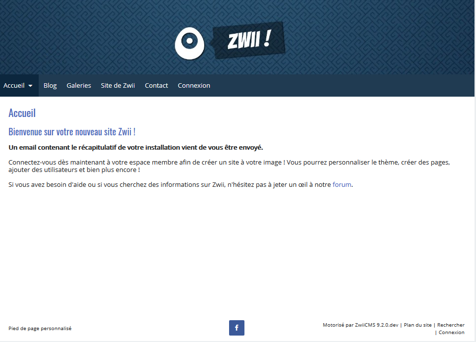

<!--
Este archivo README esta generado automaticamente<https://github.com/YunoHost/apps/tree/master/tools/readme_generator>
No se debe editar a mano.
-->

# ZwiiCMS para Yunohost

[](https://ci-apps.yunohost.org/ci/apps/zwiicms/)  

[](https://install-app.yunohost.org/?app=zwiicms)

*[Leer este README en otros idiomas.](./ALL_README.md)*

> *Este paquete le permite instalarZwiiCMS rapidamente y simplement en un servidor YunoHost.*  
> *Si no tiene YunoHost, visita [the guide](https://yunohost.org/install) para aprender como instalarla.*

## Descripción general

Zwii is a database-less (flat-file) CMS that allows you to easily create and manage a web site without any programming knowledge.

### Features

- No Database
- Multi-users
- Multilingual
- 100% responsive
- WYSIWYG editor
- Files manager
- Flexible


**Versión actual:** 13.3.07~ynh1

## Capturas



## Documentaciones y recursos

- Sitio web oficial: <https://zwiicms.com/>
- Documentación usuario oficial: <https://www.zwiicms.fr/prise-en-main>
- Repositorio del código fuente oficial de la aplicación : <https://forge.chapril.org/ZwiiCMS-Team/ZwiiCMS>
- Catálogo YunoHost: <https://apps.yunohost.org/app/zwiicms>
- Reportar un error: <https://github.com/YunoHost-Apps/zwiicms_ynh/issues>

## Información para desarrolladores

Por favor enviar sus correcciones a la [rama `testing`](https://github.com/YunoHost-Apps/zwiicms_ynh/tree/testing).

Para probar la rama `testing`, sigue asÍ:

```bash
sudo yunohost app install https://github.com/YunoHost-Apps/zwiicms_ynh/tree/testing --debug
o
sudo yunohost app upgrade zwiicms -u https://github.com/YunoHost-Apps/zwiicms_ynh/tree/testing --debug
```

**Mas informaciones sobre el empaquetado de aplicaciones:** <https://yunohost.org/packaging_apps>
