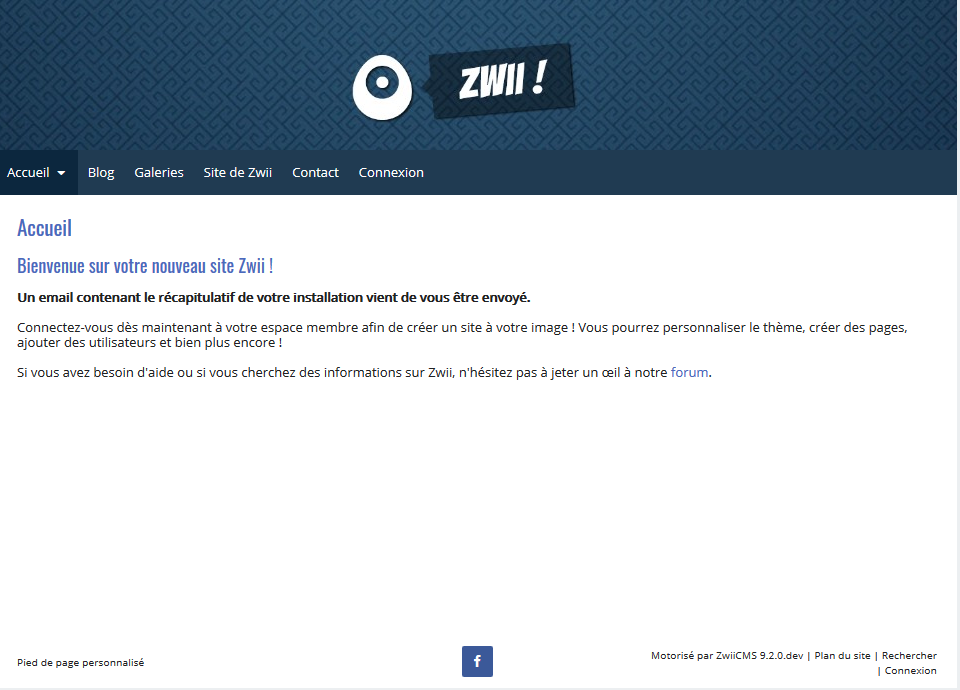

<!--
Nota bene : ce README est automatiquement généré par <https://github.com/YunoHost/apps/tree/master/tools/readme_generator>
Il NE doit PAS être modifié à la main.
-->

# ZwiiCMS pour YunoHost

[](https://ci-apps.yunohost.org/ci/apps/zwiicms/)


[](https://install-app.yunohost.org/?app=zwiicms)

*[Lire le README dans d'autres langues.](./ALL_README.md)*

> *Ce package vous permet d’installer ZwiiCMS rapidement et simplement sur un serveur YunoHost.*  
> *Si vous n’avez pas YunoHost, consultez [ce guide](https://yunohost.org/install) pour savoir comment l’installer et en profiter.*

## Vue d’ensemble

Zwii est un CMS sans base de données (fichier plat) qui vous permet de créer et de gérer facilement un site Web sans aucune connaissance en programmation.

### Caractéristiques

- Pas de base de données
- Multi-utilisateurs
- Multilingue
- 100% réactif
- Éditeur WYSIWYG
- Gestionnaire de fichiers
- Flexible


**Version incluse :** 13.5.02~ynh1

## Captures d’écran



## Documentations et ressources

- Site officiel de l’app : <https://zwiicms.com/>
- Documentation officielle utilisateur : <https://www.zwiicms.fr/prise-en-main>
- Dépôt de code officiel de l’app : <https://forge.chapril.org/ZwiiCMS-Team/ZwiiCMS>
- YunoHost Store : <https://apps.yunohost.org/app/zwiicms>
- Signaler un bug : <https://github.com/YunoHost-Apps/zwiicms_ynh/issues>

## Informations pour les développeurs

Merci de faire vos pull request sur la [branche `testing`](https://github.com/YunoHost-Apps/zwiicms_ynh/tree/testing).

Pour essayer la branche `testing`, procédez comme suit :

```bash
sudo yunohost app install https://github.com/YunoHost-Apps/zwiicms_ynh/tree/testing --debug
ou
sudo yunohost app upgrade zwiicms -u https://github.com/YunoHost-Apps/zwiicms_ynh/tree/testing --debug
```

**Plus d’infos sur le packaging d’applications :** <https://yunohost.org/packaging_apps>
