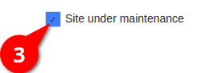

## You need now to finalize the upgrade process of ZwiiCMS directly in the app.

#### 1. Login with your admin account

#### 2. Go to setup page

#### 3. Click on Reinstall

#### 4. If needed, deactivate the maintenance mode

#### 5. Save

